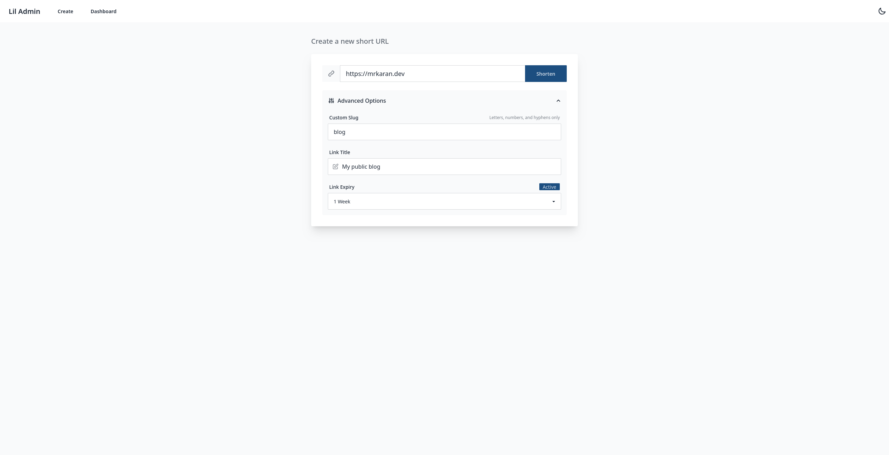
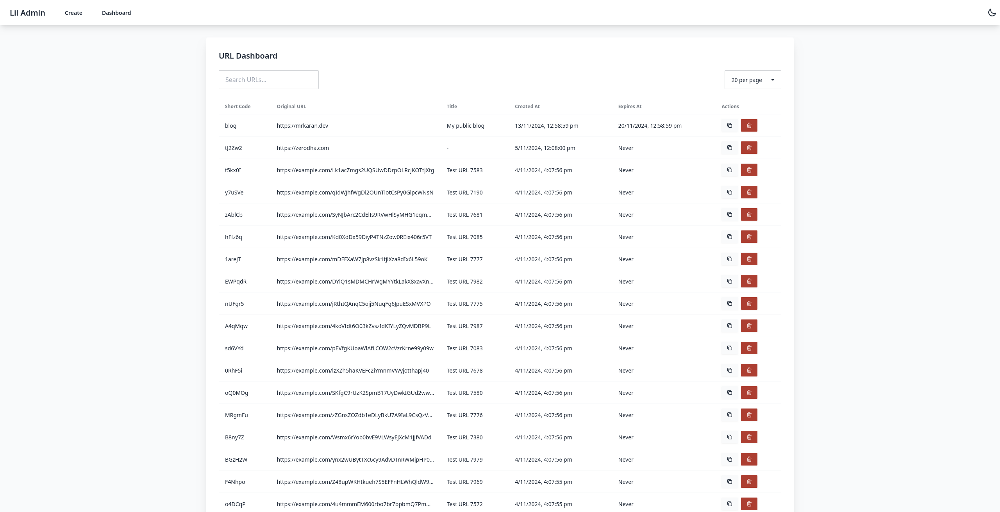
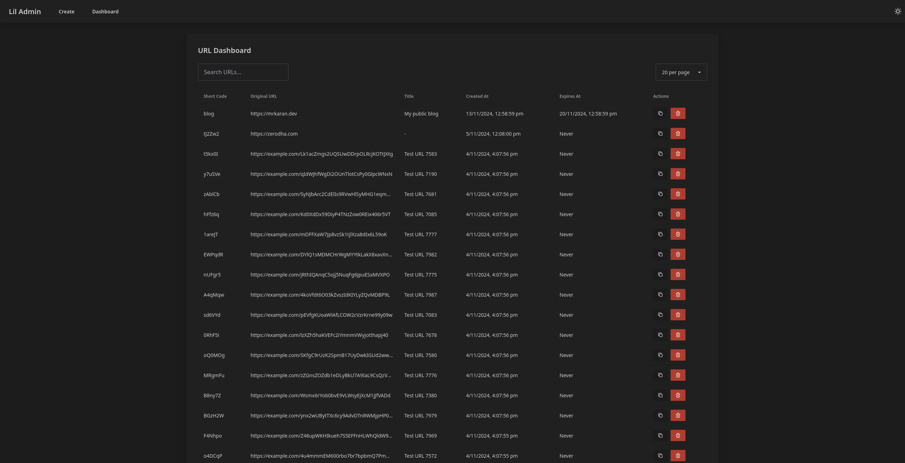

# Lil

Lil is a self-hosted URL shortener written in Go. It stores links in SQLite
and can send iOS, Android, and desktop clicks to different destinations.

Lil includes:

- transactional SQLite writes and an in-memory redirect cache
- custom slugs, expiry times, titles, and platform destinations
- a Vue admin UI for creating, editing, and deleting links
- OIDC sign-in for many users, with per-link attribution and an activity log
- per-user API tokens for scripts
- Plausible, access-log, and webhook analytics providers
- Prometheus metrics
- a JSON management API







## Start a local server

You need Go 1.26 or newer, Node 22.12 or newer, pnpm 11.3.0, and tmux.
Use Node 24 when possible.

```sh
make dev
```

Open <http://localhost:5173/admin/>. The API and short links use
<http://localhost:17000>. Local data stays in `.dev/urls.db`. The local
configuration signs every request in as `dev@example.com` (`auth.mode = "dev"`)
and disables analytics.

The development server binds to loopback. It does not expose the admin UI or
database to other computers on your network.

Useful commands:

| Command | Purpose |
|---|---|
| `make dev-logs` | Show recent API and UI logs |
| `make dev-attach` | Attach to both tmux windows |
| `make dev-restart` | Rebuild and restart after a Go change |
| `make dev-stop` | Stop the development server |
| `make check` | Run tests, static analysis, type checks, and lint checks |
| `make clean` | Clean build output without deleting the local database |

Vite reloads frontend changes. Run `make dev-restart` after a Go change.

## Configure Lil

Copy the sample before you run a release binary:

```sh
cp config.sample.toml config.toml
```

At minimum, review these settings:

```toml
[server]
address = ":7000"

[db]
path = "urls.db"

[app]
short_url_length = 6
public_url = "https://links.example.com"

[auth]
mode = "oidc"

[auth.oidc]
issuer_url = "https://accounts.google.com"
client_id = "your-client-id"
client_secret = "your-client-secret"
redirect_url = "https://links.example.com/auth/oidc"
allowed_emails = ["you@example.com"]

[analytics]
enabled = false
num_workers = 2
```

`app.public_url` is the base URL that Lil shows and copies in the admin UI.

The `[analytics]` section is optional. Lil reads `num_workers` and the provider
tables only when `analytics.enabled` is `true`. See
[`config.sample.toml`](config.sample.toml) for the provider settings. When you
enable analytics, Lil starts every provider table in the configuration unless
that table contains `enabled = false`. Delete provider tables that you do not
use.

## Authentication

Every signed-in person is an admin. Lil has no roles. Lil records who created,
updated, or deleted each link, and keeps an append-only activity log.

Lil has no unauthenticated mode. `auth.mode` must be `oidc` or `dev`. Lil
refuses to start if the `auth` settings are incomplete.

### Sign in with OIDC

Humans sign in through your identity provider (IdP). Lil stores no passwords.
Lil creates the user record on the first sign-in of a listed email. There is
no self sign-up.

1. Register an OAuth client with your IdP. Add `<admin host>/auth/oidc` as
   the redirect URI, for example `https://lil.example.com/auth/oidc`. For
   Google, create an OAuth client of type "Web application". For Zitadel,
   create a "Web" application and use the code flow.
2. Set `auth.oidc.issuer_url`, `client_id`, and `redirect_url`. Set
   `client_secret` for a confidential client. `redirect_url` must be the exact
   redirect URI and its path must be `/auth/oidc`.
3. Lil always uses PKCE (S256). `client_secret` is optional. Leave it empty
   for a public client that relies on PKCE alone. Lil then sends `client_id`
   in the token request body and no secret. Your IdP must allow the `none`
   token endpoint auth method for that client.
4. Set `allowed_emails` to every person who may sign in. Lil refuses to start
   without it. The list is strict: a person may sign in only when the IdP has
   verified their email and the lowercased email is on the list.
   `allowed_domains` is optional. When you set it, the email domain must also
   be on that list. Both checks must pass. Lil never admits a person because
   of a domain alone.

Example for a Zitadel-style issuer with a public client:

```toml
[auth.oidc]
issuer_url = "https://auth.example.com"
client_id = "your-client-id"
client_secret = ""
redirect_url = "https://lil.example.com/auth/oidc"
allowed_emails = ["you@example.com"]
```

`issuer_url` and `redirect_url` must use `https://`. Lil accepts `http://` only
for `localhost` and loopback addresses, for local IdP testing. Behind a TLS
proxy, set `redirect_url` to the external `https://` URL. The proxy must
preserve the `Host` header, because Lil's cross-origin check compares the
`Origin` header of browser writes with `Host`. The session cookie is `Secure`
when `redirect_url` uses `https://`.

When `issuer_url` is `https://accounts.google.com` and `allowed_domains` is
set, Lil checks the domain against the signed `hd` (hosted domain) claim of the
ID token. An address in `allowed_domains` on a consumer Google account is not
enough: the sign-in fails without a matching `hd`. The email must still be in
`allowed_emails`. Lil checks `hd` at sign-in only. On later requests, Lil checks
the domain of the stored email.

Lil checks the current allowlist on every request, with the same rule as at
sign-in. If you remove an email or a domain from the configuration and restart
Lil, the affected users lose access
to sessions and API tokens.

Limits to know:

- One deployment uses one issuer. Lil rejects users, sessions, and tokens from
  any other issuer.
- Lil does not link accounts by email. A different issuer or subject with the
  same email is a different user.
- Suspending a person at the IdP does not end their Lil sessions or API tokens.
  Disable the user in Lil (the Users page or `POST /api/v1/users/{id}/disable`).
  Disabling ends every session and revokes every API token of that user at
  once. Enabling the user again does not restore them.
- API tokens carry full admin power. Treat them like passwords.
- If nobody can sign in, add your email to `allowed_emails` and restart Lil.

### API tokens

Scripts authenticate with a per-user API token:

```sh
curl -H "Authorization: Bearer lil_..." https://links.example.com/api/v1/urls
```

Create and revoke tokens on the Tokens page or with `/api/v1/tokens`. Lil shows
the token once, when you create it. A request with an `Authorization` header
uses only that token: Lil never falls back to a browser session.

Prometheus scrapes `/api/v1/metrics` with a token:

```yaml
scrape_configs:
  - job_name: lil
    metrics_path: /api/v1/metrics
    scheme: https
    authorization:
      type: Bearer
      credentials: lil_...
    static_configs:
      - targets: ["links.example.com"]
```

The scrape token belongs to a user. If you disable that user, scraping stops.
Create the token for a person or team account that outlives individual staff.

### Development mode

`auth.mode = "dev"` signs every request in as `auth.dev_email`. Lil logs a
warning at startup. Use it on loopback for local work only. Never point dev mode
at a production database. Dev users and their tokens carry the issuer `dev`, and
an `oidc` deployment rejects them.

### Upgrade from Basic Auth

Versions before OIDC sign-in used one shared `[admin]` username and password.
To upgrade:

1. Back up the SQLite database. The new version runs a schema migration when
   it starts.
2. Delete the `[admin]` section and add `[auth]` as described above. Lil
   ignores `[admin]`.
3. Deploy, then sign in once through the IdP.
4. Create an API token for each script that used Basic Auth, and change the
   script to send `Authorization: Bearer <token>`. Basic Auth no longer works.

Links created before the upgrade have no recorded creator. The dashboard shows
them without one. Lil starts recording attribution from the first change after
the upgrade.

## Route by platform

A link can store four destinations:

- the original URL, which is always required
- an Android URL
- an iOS URL
- a Web URL

Clients should normally share the plain short link, such as
`https://links.example.com/rate-us`. Lil selects a platform for each click.
It uses this order:

1. Use `?platform=android`, `?platform=ios`, or `?platform=web` when present.
2. Send recognized crawlers to Web.
3. Use a quoted `Sec-CH-UA-Platform` client hint when available.
4. Parse the User-Agent header.
5. Use Web when the client remains unknown.

If the selected platform has no destination, Lil uses the original URL. It
does not append query parameters from the short link to the destination.
Queries saved in a destination, such as `?action=write-review`, stay intact.

The platform query parameter is an override for testing and callers that
already know the device. Email and website links should usually omit it.
Lil rejects empty, repeated, and unknown platform values with HTTP 400.

An iPad in desktop mode can send the same `Macintosh` User-Agent as a Mac.
Lil treats this request as Web because the server cannot distinguish the two.
Use a store-choice page as the Web destination when this case matters.

Redirects return HTTP 302 with these headers:

```text
Cache-Control: private, no-store
Vary: User-Agent
Vary: Sec-CH-UA-Platform
```

Your proxy or CDN must respect these headers. The browser and operating
system decide whether a store URL opens an app or a web page.

Each successful redirect writes a structured `redirect selected` log entry.
The entry includes the short code, platform, detection source, destination
host, destination query keys, User-Agent, Cloudflare Ray ID, and a SHA-256 hash
of the full destination. Lil does not log destination query values.

## Run with Docker Compose

The included Compose file starts Lil on loopback and stores the database in a
named volume.

```sh
docker compose up -d
```

Open <http://localhost:7000/admin/>. This configuration is for local testing.
It runs in dev mode (`auth.mode = "dev"`), so it signs every request in as
`dev@example.com` with no login. It enables only access-log analytics.

For a production deployment, provide your own `config.toml` with
`auth.mode = "oidc"`, use a reverse proxy for TLS, and restrict `/admin/` and
`/api/` as needed. Run one Lil process for each SQLite database. Separate
processes do not share redirect-cache updates.

## Run a release binary

Download an archive from [GitHub Releases](https://github.com/mr-karan/lil/releases),
extract it, and run:

```sh
./lil.bin --config=config.toml
```

The binary embeds the admin UI. Open `/admin/` on the configured server
address.

## API

| Method | Path | Purpose |
|---|---|---|
| `GET` | `/{shortCode}` | Redirect a public short link |
| `GET` | `/api/v1/health` | Check SQLite connectivity |
| `GET` | `/api/v1` | Read the version and public URL |
| `POST` | `/api/v1/shorten` | Create a link |
| `GET` | `/api/v1/urls` | List links |
| `PUT` | `/api/v1/urls/{shortCode}` | Update a link |
| `DELETE` | `/api/v1/urls/{shortCode}` | Delete a link |
| `GET` | `/api/v1/metrics` | Read Prometheus metrics |
| `GET` | `/api/v1/me` | Read the signed-in user |
| `GET` | `/api/v1/users` | List users |
| `POST` | `/api/v1/users/{id}/disable` | Disable a user (not yourself) |
| `POST` | `/api/v1/users/{id}/enable` | Enable a user |
| `GET` | `/api/v1/tokens` | List your API tokens |
| `POST` | `/api/v1/tokens` | Create an API token |
| `DELETE` | `/api/v1/tokens/{id}` | Revoke your API token |
| `GET` | `/api/v1/audit` | Read the activity log |

The health endpoint and short links are public. Every other API route needs an
API token (`Authorization: Bearer lil_...`) or a browser session. POST and
PUT requests with a body require `Content-Type: application/json`. Lil limits request bodies to 1 MiB.

See [`docs/api.md`](docs/api.md) for request and response examples.

## Storage and shutdown

SQLite is the source of truth. Lil commits a link and its platform
destinations in one transaction. It updates the redirect cache only after the
commit succeeds.

Lil uses WAL mode and synchronous commits. It handles `SIGINT` and `SIGTERM`,
stops accepting requests, waits for analytics workers, and then closes the
database.

## License

See [`LICENSE`](LICENSE).

## Contributing

Bug reports and focused pull requests are welcome.
